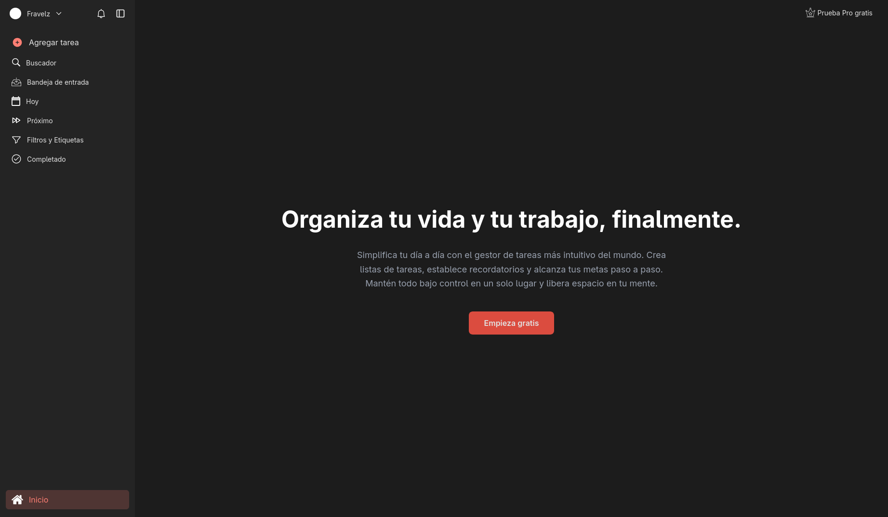

# 📋 WEB To-Do List

[Versión en español](README.md)

A modern task management app built with Next.js. Organize your life and work with an intuitive interface and clean design.



## ✨ Features

- **Inbox** — All your tasks in one place
- **Today** — Tasks scheduled for today
- **Next** — View of pending tasks
- **Search** — Find tasks quickly
- **Filters & Tags** — Organize and categorize your tasks
- **Completed** — History of completed tasks
- **Modals** — Fluid interface for creating and editing tasks
- **Sidebar** — Convenient and accessible navigation
- **Dark Mode** — Support for light and dark themes (Tailwind)

## 🛠️ Technologies

- [Next.js 16](https://nextjs.org/) — React Framework
- [React 19](https://react.dev/) — UI Library
- [TypeScript](https://www.typescriptlang.org/) — Static typing
- [Tailwind CSS 4](https://tailwindcss.com/) — Utility styles

## 📁 Project Structure

``` text
src/
├── app/ # Application routes (App Router)
│ ├── add-task/ # Create a new task
│ ├── completed/ # Completed tasks
│ ├── filters/ # Filters and tags
│ ├── inbox/ # Inbox
│ ├── next/ # Upcoming tasks
│ ├── search/ # Search
│ └── today/ # Today's tasks Today
├── components/
│ ├── layout/ # Aside, Header
│ └── ui/ # ModalPro and other components
├── context/ # React contexts (Modal, Asidebar)
└── hooks/ # Custom hooks (usePathLink)
```

## 📄 Information

Educational project.

Apache 2.0 License

**Author:** [Fravelz](https://github.com/fravelz)
