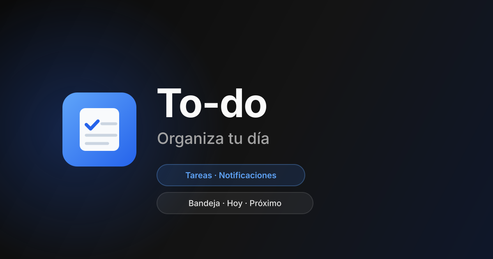

# WEB To-Do List — Lab

[English version](README.EN.md)

**Lab / Demo** (Camino A). Laboratorio de UI densa de tareas con Next.js, Vitest y modo demo
local — **no** es un producto colaborativo (sin sharing, roles ni workspaces).

Decisión: [docs/adr/0001-camino-a-lab.md](docs/adr/0001-camino-a-lab.md) · Aislamiento demo:
[docs/adr/0002-demo-store-isolation.md](docs/adr/0002-demo-store-isolation.md)

<p align="center">
  
</p>

## Qué es / qué no es

| Sí (Lab)                                            | No (congelado)               |
| --------------------------------------------------- | ---------------------------- |
| Inbox / Hoy / Próximo, etiquetas, proyectos locales | Sharing, invites, roles      |
| Modo demo en `localStorage` (sin Firestore)         | Pitch como flagship hired    |
| ≥10 tests de dominio task/label                     | Billing real / “Pro” de pago |

## Cómo probar

```bash
pnpm install
pnpm dev
```

En `/` elige **Probar en modo demo** — datos en el navegador; el banner “Lab / Modo demo” debe
verse en toda la app.

```bash
pnpm test:run   # Vitest (dominio + UI)
pnpm lint
pnpm build
```

## Documentación

- Índice: [docs/README.md](docs/README.md)
- ADRs: [docs/adr/README.md](docs/adr/README.md)

## Stack

Next.js 16 · React 19 · TypeScript · Tailwind 4 · Firebase (opcional, modo usuario) · Vitest ·
Radix · Zustand

## Licencia

Apache 2.0 — [Fravelz](https://github.com/fravelz)
